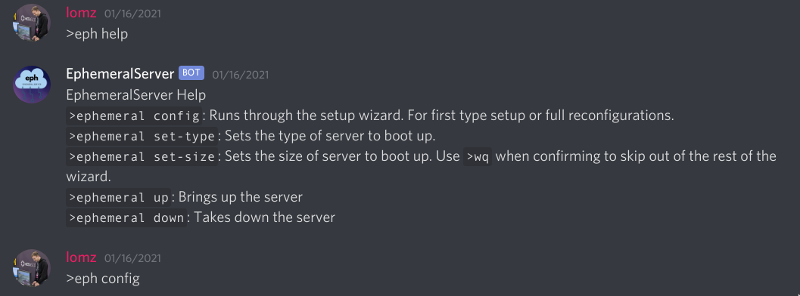

# Ephemeral Server

Hosting as you need it.

Provides a wrapper around `terraform` and `ansible` that will automatically install
a variety of programs onto a virtual private server (on AWS or Digital Ocean). Programs are installed onto a
persistent volume that persist after the more expensive VPS is shut down.

## Discord Bot

[Add to your Server](https://discord.com/oauth2/authorize?client_id=708003281070456935&permissions=3136&scope=bot)

## Encryption

Creds are stored in a private [Consul](https://www.consul.io/) server and are encrypted using AES-256
with GCM to provide data integrity.

## Supported Minecraft Server Versions/Modpacks 

Have another modpack you'd like to add? [Make a Request here](https://github.com/jack-michaud/ephemeral-server/issues/new).

### Vanilla 1.16.4 

Vanilla Minecraft version 1.16.4.

`>ephemeral set-type` 
`>ephemeral set-type vanilla-1.16.4` 

### SkyFactory 4.2.2 (MC 1.12.2)

SkyFactory 4 ([mod details](https://www.curseforge.com/minecraft/modpacks/skyfactory-4))

`>ephemeral set-type` 
`>ephemeral set-type skyfactory-4.2.2` 

